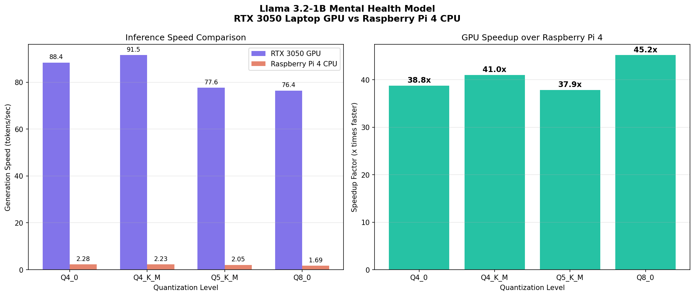

# Quantized Edge LLM: From HuggingFace to Raspberry Pi 4

Benchmarking quantized LLM inference across NVIDIA GPU and Raspberry Pi 4 ARM CPU, using my own fine-tuned Llama 3.2-1B model trained for mental health conversations.

## Models Tested

| Model | HuggingFace | Type |
|---|---|---|
| Llama 3.2-1B Mental Health | [Parigh1/Llama-3.2-1B-Mental-Health-Friend](https://huggingface.co/Parigh1/Llama-3.2-1B-Mental-Health-Friend) | LoRA fine-tune |
| Gugu 8B Mental Wellness | [Parigh1/gugu-merged](https://huggingface.co/Parigh1/gugu-merged) | Full fine-tune |

## Results



### Generation Speed (tokens/sec)

| Quantization | Size | RTX 3050 GPU | Raspberry Pi 4 | Speedup |
|---|---|---|---|---|
| Q4_K_M | 1.64 GB | **91.54** | 2.23 | **41.0x** |
| Q4_0 | 1.61 GB | 88.37 | 2.28 | 38.8x |
| Q5_K_M | 1.75 GB | 77.61 | 2.05 | 37.9x |
| Q8_0 | 2.09 GB | 76.39 | 1.69 | 45.2x |

### Key Findings

- **Q4_K_M is the optimal quantization for GPU inference** — fastest at 91.54 tok/s despite higher quality than Q4_0, due to better memory access patterns in K-quant mixed precision
- **RTX 3050 is ~40x faster than RPi4** across all quantization levels
- **Q8_0 shows highest speedup ratio (45x)** — VRAM bandwidth advantage is largest for higher-bit models
- **All 4 quantizations run on RPi4 4GB RAM** — the 1B model fits comfortably at every level
- 8B model (Gugu) at Q4_K_M (~4.7GB) exceeds RPi4 4GB RAM ceiling — sub-Q4 required for 8B edge deployment

## Pipeline

1. Download LoRA adapter from HuggingFace (`scripts/1_download_models.py`)
2. Merge LoRA adapter with base model using PEFT (`scripts/merge_adapter.py`)
3. Convert merged model to GGUF format using llama.cpp
4. Quantize to Q4_0, Q4_K_M, Q5_K_M, Q8_0 (`scripts/quantize_script.py`)
5. Benchmark on Windows GPU (`scripts/benchmark_gpu.py`)
6. Benchmark on Raspberry Pi 4 ARM CPU (`rpi4/benchmark_rpi.py`)
7. Generate comparison charts (`scripts/plot_results.py`)

## Hardware

- **Development + GPU benchmark**: Windows 11, NVIDIA RTX 3050 Laptop GPU (4GB VRAM)
- **Edge target**: Raspberry Pi 4 Model B Rev 1.5 (4GB RAM, ARM Cortex-A72, CPU-only)

## Setup

```bash
git clone https://github.com/parigh1/Quantized-Edge-LLM
cd Quantized-Edge-LLM
pip install -r requirements.txt
```

---
